# VVC Transform Type 결정 로직 (MTS 포함)

## 🎯 기본 Transform
- 모든 블록은 기본적으로 `DCT2`를 사용
- 조건을 만족하면 MTS (DST7/DCT8 등) 적용 가능

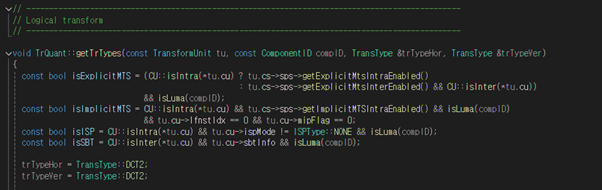

## 🔹 Explicit MTS
- 조건:
  - Intra 또는 Inter mode
  - Luma 성분
- 방식:
  - mts_idx (0~5) 중 RDO 기반으로 선택
  - mts_idx == 1 → Transform Skip (DCT2)

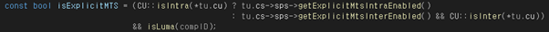

## 🔹 Implicit MTS
- 조건:
  - Intra mode + Luma
  - LFNST 미사용, MIP 미사용
  - TU 크기 4~16
- 적용: DST7 / DST7

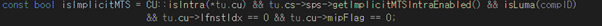

## 🔹 ISP & LFNST
- 둘 동시 적용 시 → Transform type 계산 생략 → DCT2

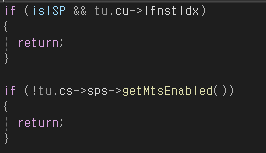

## 🔹 Implicit MTS Transform Rule
- Width, Height ∈ [4, 16]인 경우 Hor/Ver 둘 다 DST7 사용

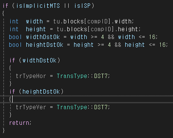

## 🔹 SBT (Sub-block Transform)
- Inter + Luma + sbtInfo 존재 시 적용

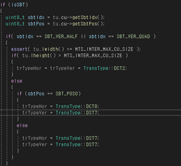

### SBT 수직 방향
- 블록 크기 초과 시 MTS 사용 금지 → DCT2 사용
- sub-block 위치에 따른 Transform

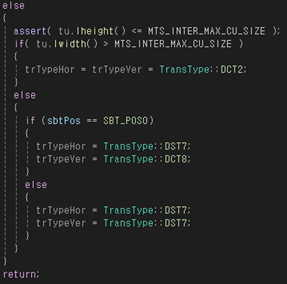
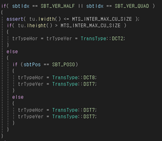

### SBT 수평 방향
- sub-block 위치에 따른 Transform

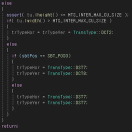

## 🔹 Explicit MTS 동작 방식
- mts_idx 값에 따른 Transform 선택
- mts_idx == 1 → Skip (DCT2 사용)

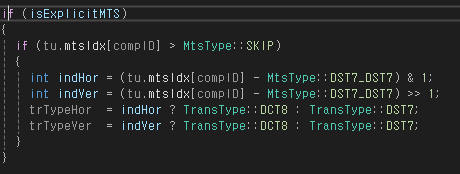
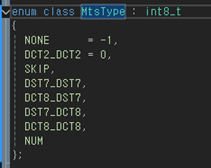

## 🔹 mts_idx 매핑 (VTM 기준)
| idx | Transform |
|-----|-----------|
| 0   | DCT2/DCT2 |
| 1   | Skip (DCT2) |
| 2   | DST7/DST7 |
| 3   | DCT8/DST7 |
| 4   | DST7/DCT8 |
| 5   | DCT8/DCT8 |

## 🔹 RD-cost 기반 선택
- Explicit MTS인 경우, 모든 `mts_idx`에 대해 변환 후 RD 비교
- 가장 효율적인 것을 선택해 signal

---

> ✅ 이 문서는 VVC/VTM 기반의 Transform Type 결정 로직을 요약한 기술 문서입니다.
